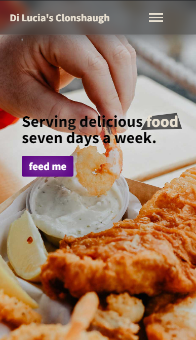
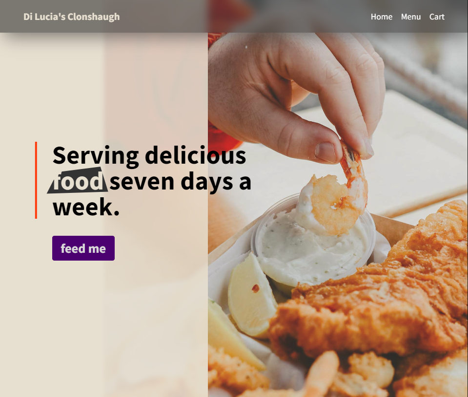
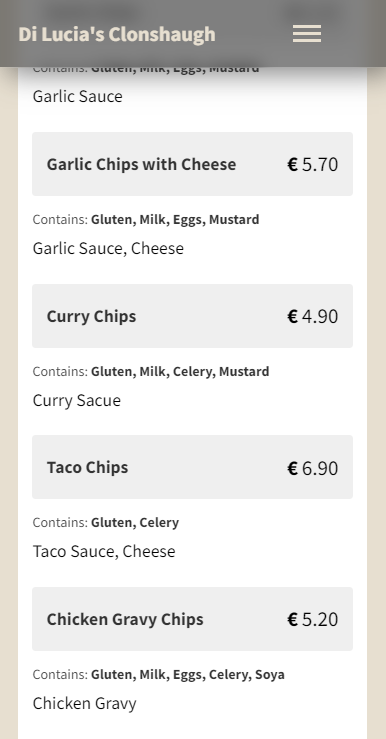
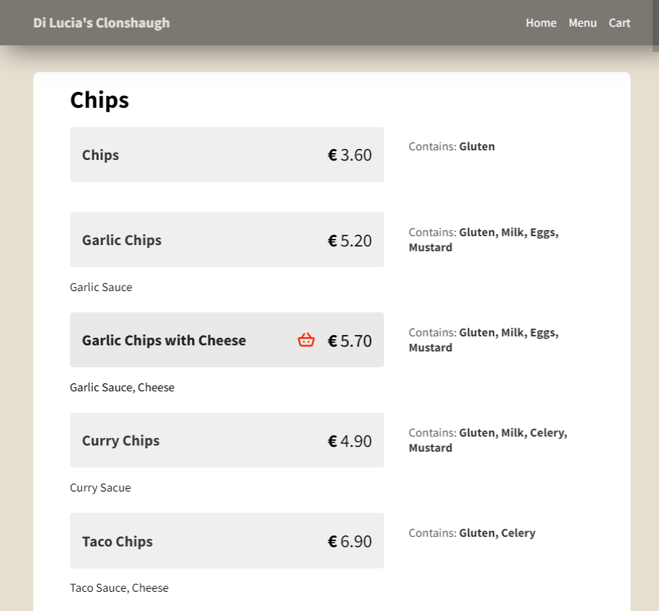
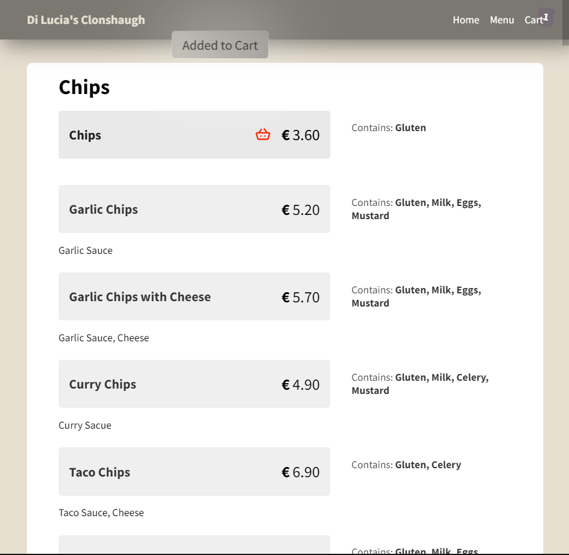
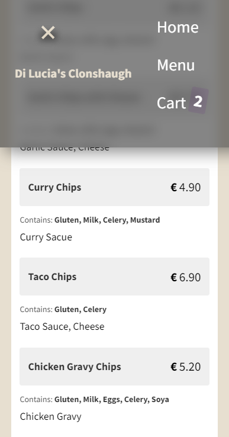
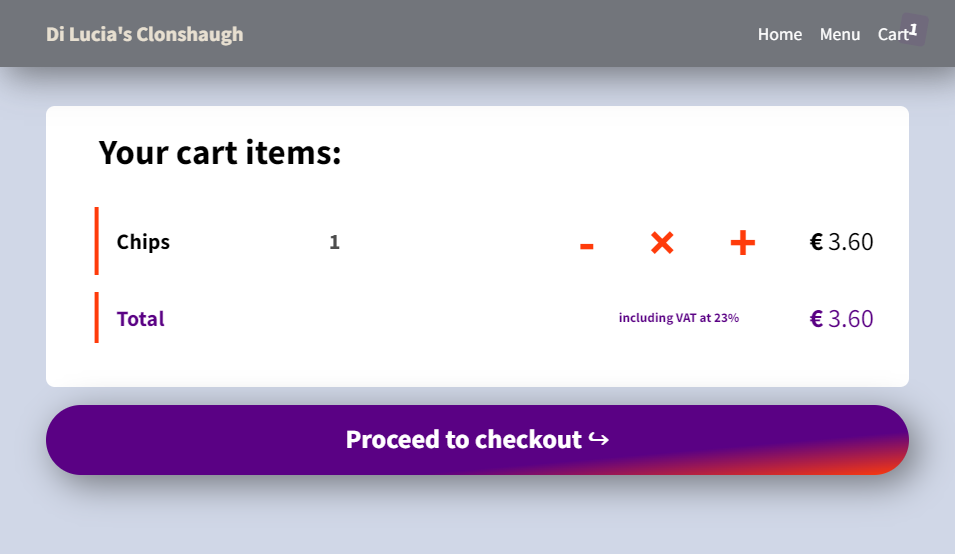
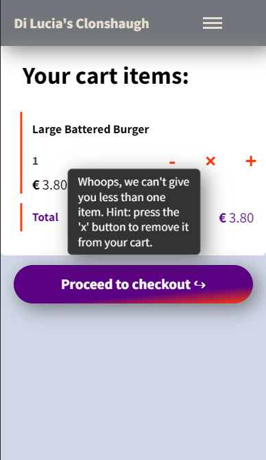
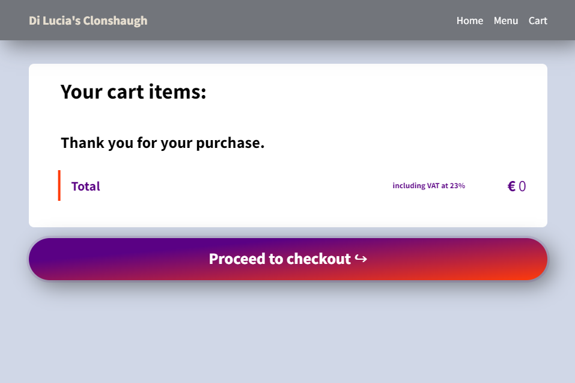

# Di Lucia's Redesign

Di Lucia's Takeaway Redesign and improved functionality.

Di Lucia's Clonshaugh is a site designed for the people of Clonshaugh to order food from their local chip shop. The site's easy to use interface will assure for a joyful expierience of getting a hearty meal.

## Features

    -  Landing page

Just a simple landing page with a headline, a background image that floats to the right side on wider screens...

and a simple call to action button which brings you to the menu.

    -  Menu

Each button container is made of three parts: the menu item itself(name and price), the allergen information and ingredients. They are displayed in a grid layout in wider screens and stacked vertically on mobile screens.

Each button also has simple hover/focus states to improve user experience. Also, whenever an item is added into the cart, a small annotation pops up in the top centre portion of the screen to let the user know that is successfully added.

The basket icon remains on the last item added just as a reminder, but of course all the items are only a click away to view from the cart (2 on mobile).

    - Cart

The little badge beside the link "Cart" in the navbar will always show how many items in total are currently in it. The good news is, even if the user exits or refreshes the page, all the items still remain in the cart because they've been also stored in the local storage.

The buttons "-", "X", "+" on each item allow the user to adjust the quantity or remove items from the cart. A gentle message appears if the user tries to get less than one item quantity.

After the user is happy with the order and presses on the Checkout button it looks like this:

The subtle gradient on the button slides up, the cart items clear and a message appears in the container of the cart.

---

## Features left to implement

-   Ability to take collection or delivery orders and send the receipts in the restaurant for processing.
-   Take comments or notes from the users when they order.
-   Add imagery to some of the main items on the menu.
-   Add products with submenus and nested options.
-   Implement a footer that appears in all pages with information such as location, business phone number, opening times etc.

## Technologies used

#### HTML, CSS, JavaScript

The content rendered comes from JavaScript objects, so that means it is also expandable. The menu is stored in key:value pairs and it is rendered to the DOM via template literals. This also means that it makes the logic implemented much stronger because all the input fields are stored in the script itself.

## Testing

The complete webpage is rendered on multiple devices and it doesn't have any bugs as of yet. Enough testing has been conducted in all aspects: semantically, logically and visually. All the design standards are met, such as:

-   visual hierarchy
-   contrast
-   legibility
-   readability
-   scale
-   alignment
-   typography
-   color theme, etc.

---

## Validators

-   ### The code in all HTML files passes with no issue.
-   ### The code in CSS files passes with no issue.
-   ### The code in JavaScript files passes with no issue.

## Unfixed Bugs

The javscript code isn't fully optimized and there's a lack of a good structure for managing state and updating the DOM. Otherwise, there aren't any other bugs.

## Deployment

The site was deployed to GitHub pages.

The live link can be found here - https://aniatki.github.io/di-lucias-redesign
